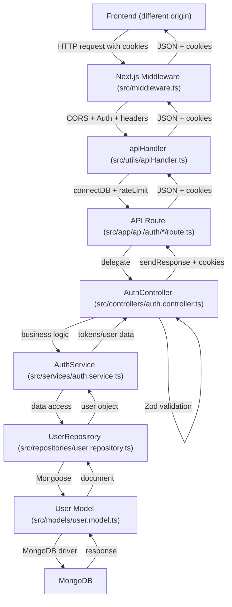
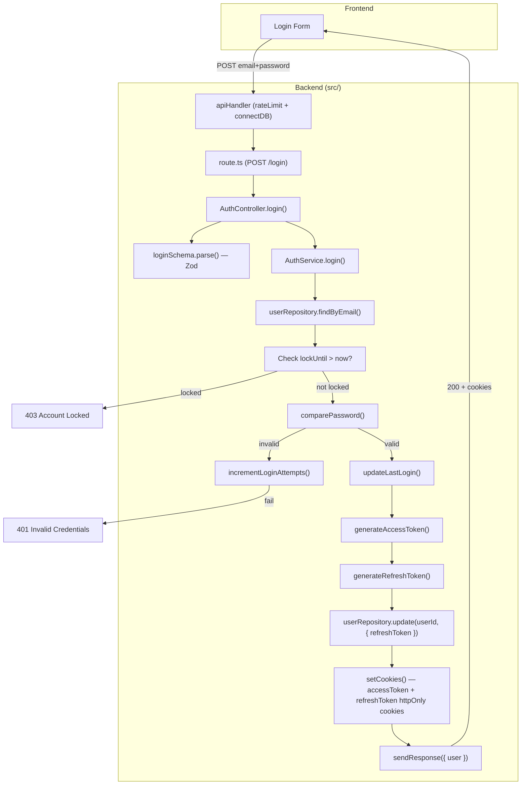
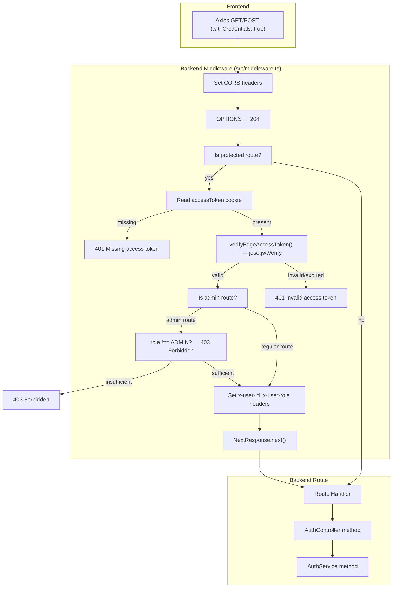
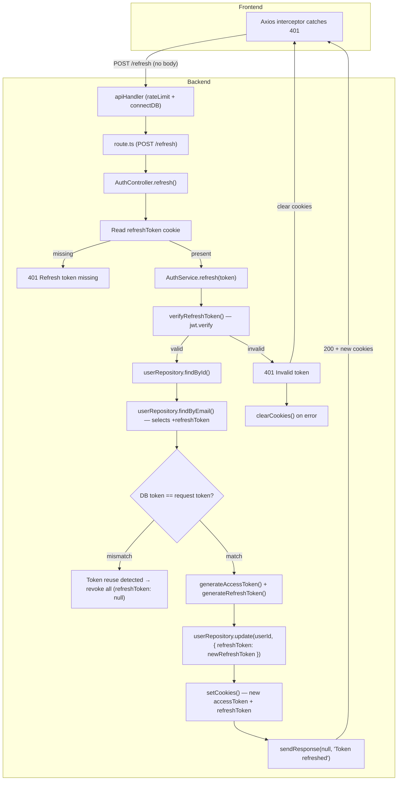
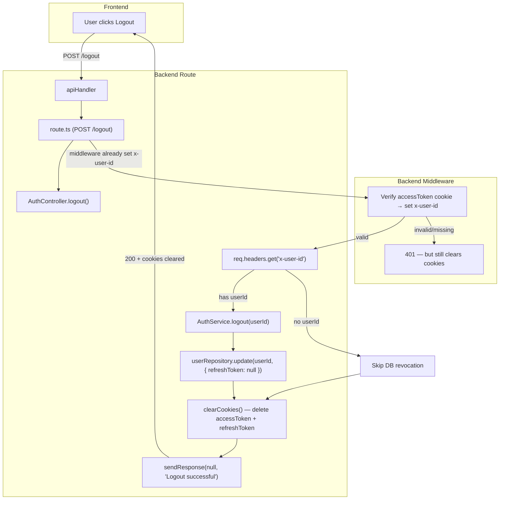
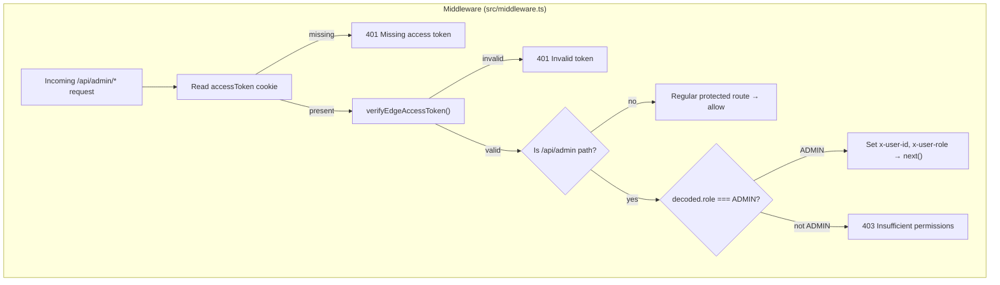

# LearnSphere Backend Architecture Audit

## 1. Audit Scope

This document is a comprehensive audit of the LearnSphere backend located at `E:\final_project/backend`.

The audit covers:
- Actual backend folder structure and file layout
- Technology stack
- Backend architecture (Next.js API routes, controller/service/repository pattern)
- Authentication architecture (JWT access + refresh token flow, HTTP-only cookies)
- Registration, login, refresh, logout, profile, password, and Google auth flows
- Role and authorization architecture
- Middleware architecture (CORS, route protection, role checking)
- Cookie and JWT contracts
- API endpoint inventory
- Request/response and error handling contracts
- Frontend integration contract (derived from backend)
- Backend findings (existing, frontend requirements, backend limitations, risks)
- Recommended frontend architecture (proposed, not yet implemented)
- Implementation roadmap (proposed, not yet implemented)
- Mermaid flow diagrams

**No backend code was modified during this audit.**

Repository location: `E:\final_project/backend`
Audit date: 2026-08-08
Backend framework: Next.js 16.2.11 (App Router)
Database: MongoDB via Mongoose 9.8.0
JWT library: `jsonwebtoken` (server-side) + `jose` (edge/middleware verification)
Password hashing: `bcryptjs`
Validation: `zod` v4
Logging: `winston`
Rate limiting: `rate-limiter-flexible` (Redis in production, memory in dev)

---

## 2. Actual Backend Folder Structure

```
backend/
├── .env.local                  # Environment variables (dev)
├── next.config.ts              # Next.js config (minimal)
├── package.json
├── tsconfig.json
├── docs/                          # ← CREATED for this audit
│   └── BACKEND_ARCHITECTURE_AUDIT.md
└── src/
    ├── app/
    │   └── api/
    │       └── auth/
    │           ├── change-password/
    │           │   └── route.ts
    │           ├── forgot-password/
    │           │   └── route.ts
    │           ├── google/
    │           │   └── route.ts
    │           ├── login/
    │           │   └── route.ts
    │           ├── logout/
    │           │   └── route.ts
    │           ├── profile/
    │           │   └── route.ts
    │           ├── refresh/
    │           │   └── route.ts
    │           ├── register/
    │           │   └── route.ts
    │           ├── reset-password/
    │           │   └── route.ts
    ├── config/
    │   └── env.ts
    ├── constants/
    │   ├── errorMessages.ts
    │   └── statusCodes.ts
    ├── controllers/
    │   └── auth.controller.ts
    ├── interfaces/
    │   └── response.interface.ts
    ├── lib/
    │   ├── db.ts
    │   ├── edgeJwt.ts
    │   ├── jwt.ts
    │   └── password.ts
    ├── middleware.ts
    ├── models/
    │   └── user.model.ts
    ├── repositories/
    │   └── user.repository.ts
    ├── services/
    │   ├── auth.service.ts
    │   └── email.service.ts
    ├── types/
    │   ├── auth.types.ts
    │   └── user.types.ts
    └── utils/
        ├── AppError.ts
        ├── apiHandler.ts
        ├── apiResponse.ts
        ├── logger.ts
        └── rateLimiter.ts
```

**Notable absences:**
- No `src/app/api/navigation/` route — there is NO navigation API endpoint in this backend.
- No `src/app/api/admin/` route files — `adminRoutes` in middleware points to `/api/admin` which has no route handler (any future admin routes would live there).
- No `src/middleware/` directory — middleware is a single file at `src/middleware.ts`.
- No `src/lib/authorization.ts` — authorization (role checking) is done inline in `middleware.ts`.
- No `src/lib/permissions.ts` — there is no permission-code system; authentication uses role-based checks only.
- No `src/config/cookies.ts` — cookie configuration is hardcoded in `AuthController.setCookies()`.

---

## 3. Technology Stack

| Layer              | Technology                          |
|--------------------|--------------------------------------|
| Framework          | Next.js 16.2.11 (App Router)           |
| Runtime            | Node.js / Edge Runtime (middleware)    |
| Language           | TypeScript 5                           |
| Database           | MongoDB (Mongoose 9.8.0)               |
| JWT Server-side    | `jsonwebtoken` 9.0.3                 |
| JWT Edge (verify)  | `jose` 6.2.6                           |
| Password Hashing   | `bcryptjs` 3.0.3 (12 rounds)           |
| Validation         | `zod` 4.4.3                           |
| Logging            | `winston` 3.19.0                      |
| Rate Limiting      | `rate-limiter-flexible` 11.2.0        |
| Email (stub)       | `EmailService` (logger stub)          |
| Google Auth        | `google-auth-library` 11.0.0          |
| Env Validation     | `src/config/env.ts` (throws if missing) |

---

## 4. Backend Architecture

The backend follows a **controller-service-repository** pattern with Next.js App Router API routes.

```
Client Request
    ↓
[apiHandler] — wraps every route: connectDB + rateLimit
    ↓
Next.js API Route (src/app/api/auth/*/route.ts)
    ↓
AuthController (src/controllers/auth.controller.ts)
    ↓
AuthService (src/services/auth.service.ts)
    ↓
UserRepository (src/repositories/user.repository.ts)
    ↓
Mongoose Model (src/models/user.model.ts)
    ↓
MongoDB
```

**Key architectural points:**
- Every API route is wrapped in `apiHandler` (src/utils/apiHandler.ts), which:
  1. Connects to MongoDB (cached connection via `connectDB`)
  2. Applies rate limiting (100 requests/60 seconds per IP)
  3. Delegates to the controller method
  4. Catches unexpected errors → returns 500 with generic message
- Controllers parse the request body, validate with Zod, call the service, and format the response using `sendResponse`.
- The middleware (`src/middleware.ts`) runs on every `/api/*` request. It:
  - Sets CORS headers
  - Handles OPTIONS preflight
  - For protected routes: extracts `accessToken` cookie, verifies via `jose` (`edgeJwt.ts`), and sets `x-user-id` and `x-user-role` headers for downstream controllers
  - For admin routes: additionally checks `decoded.role !== UserRole.ADMIN` → 403

---

## 5. Authentication Architecture

Authentication uses a **dual-token JWT system** with HTTP-only cookies.

```
Login Request (email, password)
    ↓
authService.login()
    ↓
userRepository.findByEmail()
    ↓
bcrypt comparePassword()
    ↓
generateAccessToken({ userId, role })  ← JWT short-lived (15m)
generateRefreshToken({ userId, role })  ← JWT long-lived (7d)
    ↓
userRepository.update(userId, { refreshToken })  ← stored in DB
    ↓
AuthController.setCookies() sets TWO httpOnly cookies:
  - accessToken  (15 min)
  - refreshToken (7 days)
```

**Token details:**
- Access token signed with `JWT_ACCESS_SECRET`, expires in `ACCESS_TOKEN_EXPIRES_IN` (default: 15m)
- Refresh token signed with `JWT_REFRESH_SECRET`, expires in `REFRESH_TOKEN_EXPIRES_IN` (default: 7d)
- Both tokens contain: `{ userId: string, role: string, type: 'access' | 'refresh' | 'reset' }`
- Token type is embedded in the JWT payload (`type` field) to prevent token substitution attacks

**Token verification:**
- Middleware uses `jose.jwtVerify` (edge-compatible) to verify access tokens — `src/lib/edgeJwt.ts`
- Server-side code uses `jsonwebtoken.verify` — `src/lib/jwt.ts`
- `verifyAccessToken()` checks the `type` field equals `'access'`
- `verifyRefreshToken()` checks the `type` field equals `'refresh'`
- For password reset, tokens are signed with `JWT_ACCESS_SECRET` and have `type: 'reset'`, verified via `jsonwebtoken.verify` directly in `authService`

**Protected routes (middleware):**
```
/api/auth/change-password  → requires valid accessToken cookie
/api/auth/profile           → requires valid accessToken cookie
/api/auth/logout            → requires valid accessToken cookie
```

**Admin routes (middleware):**
```
/api/admin/*                → requires valid accessToken cookie + role === 'ADMIN'
```

**Other routes (login, register, refresh, forgot-password, reset-password, google):**
- Login, register, refresh, forgot-password, reset-password, google — these are NOT in `protectedRoutes` or `adminRoutes`, so they bypass middleware authentication. The refresh endpoint reads the `refreshToken` cookie directly.

---

## 6. Registration Flow

```text
Frontend POST /api/auth/register
    ↓
apiHandler (connectDB + rateLimit)
    ↓
AuthController.register()
    ↓
registerSchema.parse(body) — Zod validation
    ↓
authService.register()
    ↓
userRepository.findByEmail() — check if user exists
    ↓
hashPassword() — bcrypt (12 rounds)
    ↓
userRepository.create({ name, email, password, provider: LOCAL })
    ↓
MongoDB
    ↓
Response: { success: true, data: { id, name, email, role }, message: "Registration successful" }
    ↓
HTTP 201 Created
```

**Endpoint:** `POST /api/auth/register`
**Auth required:** No
**Request body:**
```json
{
  "name": string (2-100 chars, trimmed),
  "email": string (valid email, lowercased, trimmed),
  "password": string (8-32 chars, must contain uppercase, lowercase, number, special char)
}
```
**Response (201):**
```json
{
  "success": true,
  "message": "Registration successful",
  "data": { "id": "<mongo_id>", "name": "...", "email": "...", "role": "STUDENT" },
  "errors": [],
  "timestamp": "2026-08-08T..."
}
```
**No cookies are set on registration.** The user must log in afterward.

---

## 7. Login Flow

```text
Frontend POST /api/auth/login
    ↓
apiHandler (connectDB + rateLimit)
    ↓
AuthController.login()
    ↓
loginSchema.parse(body) — Zod validation
    ↓
authService.login()
    ↓
userRepository.findByEmail() — selects +password +refreshToken
    ↓
Account locked check (lockUntil > now → 403 FORBIDDEN)
    ↓
comparePassword() — bcrypt compare
    ↓
If invalid: userRepository.incrementLoginAttempts() (max 5, locks 15 min)
    ↓
If valid: userRepository.updateLastLogin() (resets attempts, sets lastLogin)
    ↓
generateAccessToken({ userId, role })
generateRefreshToken({ userId, role })
    ↓
userRepository.update(userId, { refreshToken }) — DB storage for rotation
    ↓
AuthController.setCookies():
  - accessToken cookie  (httpOnly, 15 min, sameSite=strict, path=/)
  - refreshToken cookie (httpOnly, 7 days, sameSite=strict, path=/)
    ↓
Response: { success: true, data: { user: { id, name, email, role } }, message: "Login successful" }
    ↓
HTTP 200 OK
```

**Endpoint:** `POST /api/auth/login`
**Auth required:** No
**Request body:**
```json
{
  "email": string (valid email),
  "password": string (min 1 char)
}
```
**Response (200):**
```json
{
  "success": true,
  "message": "Login successful",
  "data": {
    "user": {
      "id": "<mongo_id>",
      "name": "...",
      "email": "...",
      "role": "ADMIN|TEACHER|STUDENT|PARENT"
    }
  },
  "errors": [],
  "timestamp": "2026-08-08T..."
}
```
**Cookies set:**
| Cookie | httpOnly | Secure | SameSite | MaxAge (seconds) | Path |
|--------|----------|--------|----------|-------------------|------|
| accessToken | true | NODE_ENV==="production" | strict | 900 (15 min) | / |
| refreshToken | true | NODE_ENV==="production" | strict | 604800 (7 days) | / |

---

## 8. Access Token Flow

```text
Frontend Request (any protected route)
    ↓
Next.js Middleware (src/middleware.ts)
    ↓
req.cookies.get("accessToken")?.value
    ↓
If missing → 401 Unauthorized
    ↓
verifyEdgeAccessToken(accessToken) — jose.jwtVerify with JWT_ACCESS_SECRET
    ↓
Decoded: { userId, role, type, ... }
    ↓
If type !== 'access' implicitly checked by verifyEdgeAccessToken
    ↓
Headers set on request:
  - x-user-id: decoded.userId
  - x-user-role: decoded.role
    ↓
NextResponse.next() with augmented headers
    ↓
Controller reads req.headers.get("x-user-id")
```

**Protected routes:**
- `/api/auth/change-password`
- `/api/auth/profile`
- `/api/auth/logout`

**Admin routes:**
- `/api/admin` (and sub-paths) — requires additional role check: `decoded.role !== UserRole.ADMIN` → 403 Forbidden

**Unauthorized response (missing token):**
```json
{
  "success": false,
  "message": "Unauthorized access.",
  "data": null,
  "errors": ["Missing access token"],
  "timestamp": "..."
}
```
Status: 401

**Forbidden response (insufficient role):**
```json
{
  "success": false,
  "message": "You do not have permission to perform this action.",
  "data": null,
  "errors": ["Insufficient permissions"],
  "timestamp": "..."
}
```
Status: 403

**Invalid token response:**
```json
{
  "success": false,
  "message": "Invalid token.",
  "data": null,
  "errors": ["Invalid access token"],
  "timestamp": "..."
}
```
Status: 401

---

## 9. Refresh Token Flow

```text
Frontend POST /api/auth/refresh
    ↓
apiHandler (connectDB + rateLimit)
    ↓
AuthController.refresh()
    ↓
req.cookies.get("refreshToken")?.value
    ↓
If missing → 401 "Refresh token missing"
    ↓
authService.refresh(refreshToken)
    ↓
verifyRefreshToken(token) — jsonwebtoken.verify with JWT_REFRESH_SECRET
    ↓
Check type === 'refresh'
    ↓
userRepository.findById(decoded.userId)
    ↓
userRepository.findByEmail(user.email) — selects +refreshToken
    ↓
Compare DB refreshToken vs token  ← ROTATION CHECK
    ↓
If mismatch → revoke all tokens (set refreshToken: null), 401 (token reuse detected)
    ↓
If match → generate NEW access + refresh tokens
    ↓
userRepository.update(userId, { refreshToken: newRefreshToken })  ← ROTATION
    ↓
AuthController.setCookies() — sets new accessToken + refreshToken cookies
    ↓
Response: { success: true, data: null, message: "Token refreshed" }
    ↓
HTTP 200 OK
```

**Endpoint:** `POST /api/auth/refresh`
**Auth required:** No (reads cookie directly)
**Request body:** None
**Response (200):**
```json
{
  "success": true,
  "message": "Token refreshed",
  "data": null,
  "errors": [],
  "timestamp": "..."
}
```
**Cookies updated:** Same as login — new accessToken (15 min) + new refreshToken (7 days).

**Key behavior:** Token rotation — every refresh generates a new refresh token and stores it in the DB. If an old refresh token is reused, it's treated as a reuse attack: all tokens are revoked and the user is logged out.

---

## 10. Logout Flow

```text
Frontend POST /api/auth/logout
    ↓
apiHandler (connectDB + rateLimit)
    ↓
Middleware: accessToken cookie verified → sets x-user-id header
    ↓
AuthController.logout()
    ↓
userId = req.headers.get("x-user-id")
    ↓
If userId present → authService.logout(userId)
    ↓
userRepository.update(userId, { refreshToken: null })  ← revoke in DB
    ↓
AuthController.clearCookies() — deletes accessToken + refreshToken cookies
    ↓
Response: { success: true, data: null, message: "Logout successful" }
    ↓
HTTP 200 OK
```

**Endpoint:** `POST /api/auth/logout`
**Auth required:** Yes (access token cookie)
**Request body:** None
**Response (200):**
```json
{
  "success": true,
  "message": "Logout successful",
  "data": null,
  "errors": [],
  "timestamp": "..."
}
```
**Cookies cleared:** `accessToken` and `refreshToken` are deleted (expired).

**Note:** The user ID is obtained from `x-user-id` header, which is set by the middleware after verifying the access token cookie. If `x-user-id` is absent (e.g., no valid token), the logout still clears cookies but skips DB revocation.

---

## 11. Profile Flow

```text
Frontend GET /api/auth/profile
    ↓
apiHandler (connectDB + rateLimit)
    ↓
Middleware: accessToken cookie verified → sets x-user-id header
    ↓
AuthController.getProfile()
    ↓
userId = req.headers.get("x-user-id")
    ↓
authService.getProfile(userId)
    ↓
userRepository.findById(userId) — selects +password but not +refreshToken
    ↓
Response: { id, name, email, role, avatar }  ← note: no password/refreshToken
    ↓
sendResponse(user, "Profile fetched successfully")
    ↓
HTTP 200 OK
```

**Endpoint:** `GET /api/auth/profile`
**Auth required:** Yes (access token cookie)
**Request body:** None
**Response (200):**
```json
{
  "success": true,
  "message": "Profile fetched successfully",
  "data": {
    "id": "<mongo_id>",
    "name": "...",
    "email": "...",
    "role": "ADMIN|TEACHER|STUDENT|PARENT",
    "avatar": "https://..." | null
  },
  "errors": [],
  "timestamp": "..."
}
```

### Update Profile (PUT)

**Endpoint:** `PUT /api/auth/profile`
**Auth required:** Yes (access token cookie)
**Request body:**
```json
{
  "name": string (optional, 2-100 chars),
  "avatar": string (optional, valid URL)
}
```
**Response (200):**
```json
{
  "success": true,
  "message": "Profile updated successfully",
  "data": {
    "id": "<mongo_id>",
    "name": "...",
    "email": "...",
    "avatar": "https://..." | null
  },
  "errors": [],
  "timestamp": "..."
}
```

---

## 12. Change Password Flow

```text
Frontend POST /api/auth/change-password
    ↓
apiHandler (connectDB + rateLimit)
    ↓
Middleware: accessToken cookie verified → sets x-user-id, x-user-role headers
    ↓
AuthController.changePassword()
    ↓
userId = req.headers.get("x-user-id")
    ↓
changePasswordSchema.parse(body) — Zod validation
    ↓
authService.changePassword(userId, data)
    ↓
userRepository.findById(userId)
    ↓
comparePassword(currentPassword, user.password)
    ↓
hashPassword(data.newPassword)
    ↓
userRepository.update(userId, { password, passwordChangedAt: now, refreshToken: null })
    ↓
AuthController.clearCookies() — revokes session
    ↓
Response: { success: true, data: null, message: "Password changed successfully. Please login again." }
    ↓
HTTP 200 OK
```

**Endpoint:** `POST /api/auth/change-password`
**Auth required:** Yes (access token cookie)
**Request body:**
```json
{
  "currentPassword": string (min 1),
  "newPassword": string (8-32 chars, uppercase, lowercase, number, special char)
}
```
**Validation:** `currentPassword !== newPassword` (enforced by Zod refine)
**Response (200):**
```json
{
  "success": true,
  "message": "Password changed successfully. Please login again.",
  "data": null,
  "errors": [],
  "timestamp": "..."
}
```
**Side effects:** All tokens are revoked (`refreshToken: null`) and cookies cleared. User must log in again.
**Errors:**
- 400 if current password doesn't match
- 401 if user not found or no password (e.g., Google-only user)

---

## 13. Forgot Password Flow

```text
Frontend POST /api/auth/forgot-password
    ↓
apiHandler (connectDB + rateLimit)
    ↓
AuthController.forgotPassword()
    ↓
body.email (validated inline — only checks truthiness)
    ↓
authService.forgotPassword(email)
    ↓
userRepository.findByEmail(email)
    ↓
If user not found → silent return (no error thrown)
    ↓
jwt.sign({ userId, type: 'reset' }, JWT_ACCESS_SECRET, { expiresIn: '15m' })
    ↓
emailService.sendPasswordResetEmail(email, resetToken)
    ↓
Response: { success: true, data: null, message: "If an account exists with that email, a reset link will be sent." }
    ↓
HTTP 200 OK (always 200, even if email doesn't exist)
```

**Endpoint:** `POST /api/auth/forgot-password`
**Auth required:** No
**Request body:**
```json
{
  "email": string (must be truthy — not Zod-validated, just truthiness check)
}
```
**Response (200):**
```json
{
  "success": true,
  "message": "If an account exists with that email, a reset link will be sent.",
  "data": null,
  "errors": [],
  "timestamp": "..."
}
```
**Reset token:** Signed with `JWT_ACCESS_SECRET`, has `type: 'reset'`, expires in 15 minutes. Sent via email (currently logged, not actually emailed).

---

## 14. Reset Password Flow

```text
Frontend POST /api/auth/reset-password
    ↓
apiHandler (connectDB + rateLimit)
    ↓
AuthController.resetPassword()
    ↓
resetPasswordSchema.parse(body) — Zod validation
    ↓
authService.resetPassword(data)
    ↓
jwt.verify(data.token, JWT_ACCESS_SECRET) as JwtPayload
    ↓
Check decoded.type === 'reset'
    ↓
userRepository.findById(decoded.userId)
    ↓
hashPassword(data.newPassword)
    ↓
userRepository.update(userId, { password, passwordChangedAt: now, refreshToken: null })
    ↓
Response: { success: true, data: null, message: "Password reset successfully" }
    ↓
HTTP 200 OK
```

**Endpoint:** `POST /api/auth/reset-password`
**Auth required:** No (uses reset token in body)
**Request body:**
```json
{
  "token": string (reset token from email link),
  "newPassword": string (8-32 chars, uppercase, lowercase, number, special char)
}
```
**Response (200):**
```json
{
  "success": true,
  "message": "Password reset successfully",
  "data": null,
  "errors": [],
  "timestamp": "..."
}
```
**Errors:**
- 400 if token is invalid or expired, or user not found
- Side effects: All refresh tokens revoked (`refreshToken: null`)

---

## 15. Google Authentication Flow

```text
Frontend POST /api/auth/google
    ↓
apiHandler (connectDB + rateLimit)
    ↓
AuthController.googleLogin()
    ↓
googleLoginSchema.parse(body) — Zod validation (requires idToken)
    ↓
authService.googleLogin(idToken)
    ↓
import('google-auth-library').OAuth2Client(env.GOOGLE_CLIENT_ID)
    ↓
client.verifyIdToken({ idToken, audience: GOOGLE_CLIENT_ID })
    ↓
payload = ticket.getPayload()
    ↓
If !payload or !payload.email → 401
    ↓
userRepository.findByEmail(payload.email)
    ↓
If user not found:
  → userRepository.create({
      name: payload.name || email.split('@')[0],
      email: payload.email,
      provider: GOOGLE,
      providerId: payload.sub,
      avatar: payload.picture,
      isVerified: payload.email_verified || false,
    })
If user found but no providerId:
  → userRepository.update(userId, { providerId, provider: GOOGLE, isVerified: true })
    ↓
userRepository.updateLastLogin(userId)
    ↓
generateAccessToken({ userId, role })
generateRefreshToken({ userId, role })
    ↓
userRepository.update(userId, { refreshToken })
    ↓
AuthController.setCookies() — accessToken + refreshToken cookies
    ↓
Response: { success: true, data: { user: { id, name, email, role, avatar } }, message: "Google Login successful" }
    ↓
HTTP 200 OK
```

**Endpoint:** `POST /api/auth/google`
**Auth required:** No
**Request body:**
```json
{
  "idToken": string (Google ID token)
}
```
**Response (200):**
```json
{
  "success": true,
  "message": "Google Login successful",
  "data": {
    "user": {
      "id": "<mongo_id>",
      "name": "...",
      "email": "...",
      "role": "ADMIN|TEACHER|STUDENT|PARENT",
      "avatar": "https://..."
    }
  },
  "errors": [],
  "timestamp": "..."
}
```
**Cookies set:** Same as login (accessToken 15 min, refreshToken 7 days, both httpOnly).

---

## 16. Role & Authorization Architecture

### Role Enum

Defined in `src/types/user.types.ts`:
```typescript
export enum UserRole {
  ADMIN = "ADMIN",
  TEACHER = "TEACHER",
  STUDENT = "STUDENT",
  PARENT = "PARENT",
}
```

### Auth Provider Enum

```typescript
export enum AuthProvider {
  LOCAL = "LOCAL",
  GOOGLE = "GOOGLE",
}
```

### Where role is stored
- In the MongoDB `User` collection: `role` field (String, enum: `UserRole` values, default: `STUDENT`)
- The role is also stored in the JWT payload (`role` field) for stateless authorization in middleware

### Role in JWT
The role is embedded in both access and refresh tokens at issuance time:
```typescript
generateAccessToken({ userId: user._id.toString(), role: user.role })
generateRefreshToken({ userId: user._id.toString(), role: user.role })
```

### Middleware role checking
In `src/middleware.ts`:
```typescript
const decoded = await verifyEdgeAccessToken(accessToken);
if (isAdmin && decoded.role !== UserRole.ADMIN) {
  return createJsonError(403, "Forbidden", ["Insufficient permissions"], origin);
}
```
- Admin routes (`/api/admin`) require `decoded.role === "ADMIN"`
- Regular protected routes only require a valid access token (no role check)

### Permissions field
The `User` model has a `permissions: string[]` field (default: `[]`), but it is **not used** anywhere in the current auth flow. Role-based checks are the only authorization mechanism.

### Frontend navigation implications
- Frontend must read the user's `role` from the `/api/auth/profile` response to determine navigation menus
- Frontend must NOT read role from JWT tokens (they are HTTP-only cookies)
- The backend has no `/api/navigation` endpoint — navigation structure must be either:
  - Hardcoded in the frontend (role-based)
  - OR the frontend makes a profile call and maps roles to local nav definitions

---

## 17. Middleware / Proxy Architecture

### File: `src/middleware.ts`

This is a **Next.js middleware** (not a proxy). It runs on every request matching `matcher: ["/api/:path*"]`.

**Architecture:**
```
Every /api/* request
    ↓
middleware.ts
    ↓
1. Set CORS headers on all responses
2. Handle OPTIONS preflight (→ 204)
3. Check if route is protected or admin
4. If protected/admin:
   a. Read accessToken cookie
   b. If missing → 401
   c. Verify with jose (edgeJwt.ts)
   d. If admin route and role !== ADMIN → 403
   e. Set x-user-id and x-user-role headers
5. NextResponse.next() — continue to route handler
```

**There is NO proxy.ts file.** The backend is a standalone Next.js application. API routes are defined in `src/app/api/auth/`. There is no reverse proxy or API gateway.

**CORS configuration (inline in middleware):**
- `Access-Control-Allow-Origin`: Set to `FRONTEND_ORIGIN` env var (default `http://localhost:3000`) — reflects the request origin
- `Access-Control-Allow-Credentials`: `true`
- `Allow-Methods`: `GET,POST,PUT,PATCH,DELETE,OPTIONS`
- `Allow-Headers`: `Content-Type,Authorization,X-Requested-With`

**Cookie reading in middleware:**
- Access token is read from `req.cookies.get("accessToken")?.value`
- Refresh token is read from `req.cookies.get("refreshToken")?.value` directly in the refresh controller

---

## 18. Cookie Contract

| Cookie         | Purpose          | HTTP Only | Secure                          | SameSite | Max Age (seconds) | Path |
|---------------|------------------|-----------|---------------------------------|----------|-------------------|------|
| accessToken   | Authenticate API requests | true | `true` in production only (`NODE_ENV === "production"`) | strict   | 900 (15 min)      | /    |
| refreshToken  | Token rotation / silent refresh | true | `true` in production only | strict   | 604800 (7 days)   | /    |

**Cookie setting code:** (`src/controllers/auth.controller.ts`, `setCookies()`)
```typescript
res.cookies.set("accessToken", accessToken, {
  httpOnly: true,
  secure: process.env.NODE_ENV === "production",
  sameSite: "strict",
  maxAge: 15 * 60,  // 900 seconds
  path: "/",
});

res.cookies.set("refreshToken", refreshToken, {
  httpOnly: true,
  secure: process.env.NODE_ENV === "production",
  sameSame: "strict",
  maxAge: 7 * 24 * 60 * 60,  // 604800 seconds
  path: "/",
});
```

**Cookie clearing:** (`clearCookies()`)
```typescript
res.cookies.delete("accessToken");
res.cookies.delete("refreshToken");
```
Note: `delete` (not `clear`) is used. In Next.js, `cookies.delete()` removes the cookie by setting it with `maxAge: 0`.

**Constraints for frontend:**
- `accessToken` and `refreshToken` are **HTTP-only** — the frontend JavaScript CANNOT read them.
- The frontend must rely on the `/api/auth/profile` endpoint to determine if a user is logged in.
- The frontend must NOT attempt to read cookies via `document.cookie`.
- Cookie `sameSite: "strict"` means cross-origin requests won't include cookies. Since the frontend is a separate origin (localhost:3000 or different port), the frontend must make requests to the backend with `credentials: "include"` (Axios: `withCredentials: true`).

---

## 19. JWT Contract

### JWT Structure

**Access Token Payload:**
```json
{
  "userId": "<mongo_id>",
  "role": "ADMIN|TEACHER|STUDENT|PARENT",
  "type": "access",
  "iat": <timestamp>,
  "exp": <timestamp>  // 15 min from iat
}
```

**Refresh Token Payload:**
```json
{
  "userId": "<mongo_id>",
  "role": "ADMIN|TEACHER|STUDENT|PARENT",
  "type": "refresh",
  "iat": <timestamp>,
  "exp": <timestamp>  // 7 days from iat
}
```

**Reset Token Payload:**
```json
{
  "userId": "<mongo_id>",
  "type": "reset"
}
```
(Expires in 15 minutes, signed with `JWT_ACCESS_SECRET`)

### JWT Configuration

| Property            | Value                              |
|---------------------|------------------------------------|
| Access secret       | `JWT_ACCESS_SECRET` env var        |
| Refresh secret      | `JWT_REFRESH_SECRET` env var       |
| Access expiry       | `ACCESS_TOKEN_EXPIRES_IN` (default: 15m) |
| Refresh expiry      | `REFRESH_TOKEN_EXPIRES_IN` (default: 7d) |
| Dev secrets         | `dev-access-secret` / `dev-refresh-secret` |
| Algorithm           | HS256 (default in jsonwebtoken/jose) |

### Token Type Field
The `type` field in the JWT payload prevents token substitution:
- Access tokens have `type: "access"` — middleware rejects tokens without this type
- Refresh tokens have `type: "refresh"` — refresh endpoint rejects tokens without this type
- Reset tokens have `type: "reset"` — reset endpoint rejects non-reset tokens

### Verification Libraries
- **Middleware (edge):** `jose.jwtVerify` in `src/lib/edgeJwt.ts`
- **Server-side:** `jsonwebtoken.verify` in `src/lib/jwt.ts`

---

## 20. API Endpoint Inventory

| Method | Endpoint                    | Auth Required | Role     | Request                  | Response                     | Status |
|--------|-----------------------------|---------------|----------|--------------------------|------------------------------|--------|
| POST   | /api/auth/register          | No            | -        | RegisterInput            | { user: { id, name, email, role } } | 201    |
| POST   | /api/auth/login             | No            | -        | LoginInput               | { user: { id, name, email, role } } + cookies | 200    |
| POST   | /api/auth/refresh           | No (cookie)   | -        | none                     | null                         | 200    |
| POST   | /api/auth/logout            | Yes (cookie)  | -        | none                     | null                         | 200    |
| GET    | /api/auth/profile           | Yes (cookie)  | -        | none                     | { user: { id, name, email, role, avatar } } | 200    |
| PUT    | /api/auth/profile           | Yes (cookie)  | -        | UpdateProfileInput       | { user: { id, name, email, avatar } } | 200    |
| POST   | /api/auth/change-password   | Yes (cookie)  | -        | ChangePasswordInput      | null                         | 200    |
| POST   | /api/auth/forgot-password   | No            | -        | { email: string }        | null                         | 200    |
| POST   | /api/auth/reset-password    | No (token)    | -        | ResetPasswordInput       | null                         | 200    |
| POST   | /api/auth/google            | No            | -        | GoogleLoginInput         | { user: { id, name, email, role, avatar } } + cookies | 200    |

### Request/Response Type Summary

**RegisterInput:**
```typescript
{
  name: string,        // 2-100 chars, trimmed
  email: string,       // valid email, lowercased
  password: string,    // 8-32 chars, uppercase+lowercase+number+special
}
```

**LoginInput:**
```typescript
{
  email: string,       // valid email, lowercased
  password: string,    // min 1 char
}
```

**ChangePasswordInput:**
```typescript
{
  currentPassword: string,    // min 1 char
  newPassword: string,         // 8-32 chars, uppercase+lowercase+number+special
  // currentPassword !== newPassword (Zod refine)
}
```

**ResetPasswordInput:**
```typescript
{
  token: string,        // reset token from email
  newPassword: string,  // 8-32 chars, uppercase+lowercase+number+special
}
```

**UpdateProfileInput:**
```typescript
{
  name?: string,    // 2-100 chars, optional
  avatar?: string,  // valid URL, optional
}
```

**GoogleLoginInput:**
```typescript
{
  idToken: string,  // Google ID token
}
```

---

## 21. Request / Response Contracts

### Standard Success Response

All responses use the `ApiResponse<T>` interface (`src/interfaces/response.interface.ts`):
```typescript
interface ApiResponse<T = unknown> {
  success: boolean;
  message: string;
  data: T | null;
  errors: string[];
  timestamp: string;  // ISO string
}
```

All responses are wrapped via `sendResponse()`:
```typescript
function sendResponse(data, message = 'Success', errors = []) {
  return {
    success: errors.length === 0,  // true if no errors, false otherwise
    message,
    data,
    errors,
    timestamp: new Date().toISOString(),
  };
}
```

### Standard Error Response

Errors are handled in two places:

**1. Controller-level `handleError()` (src/controllers/auth.controller.ts):**
```typescript
if (error instanceof z.ZodError) {
  return NextResponse.json(
    sendResponse(null, "Validation Error", error.issues.map(e => e.message)),
    { status: 400 }
  );
}
if (error instanceof AppError) {
  return NextResponse.json(
    sendResponse(null, error.message, error.errors),
    { status: error.statusCode }
  );
}
// Fallback
return NextResponse.json(
  sendResponse(null, "Internal Server Error"),
  { status: 500 }
);
```

**2. apiHandler wrapper-level catch (src/utils/apiHandler.ts):**
```typescript
catch (error) {
  return NextResponse.json(
    sendResponse(null, "An unexpected error occurred."),
    { status: 500 }
  );
}
```

**Error response shape:**
```json
{
  "success": false,
  "message": "Error message here",
  "data": null,
  "errors": ["array of error strings"],
  "timestamp": "2026-08-08T..."
}
```

### CORS Headers (set on all responses)

| Header                     | Value                                              |
|----------------------------|----------------------------------------------------|
| Access-Control-Allow-Origin| `<FRONTEND_ORIGIN>` (reflects request origin)      |
| Access-Control-Allow-Credentials | `true`                                      |
| Access-Control-Allow-Methods | `GET,POST,PUT,PATCH,DELETE,OPTIONS`             |
| Access-Control-Allow-Headers | `Content-Type,Authorization,X-Requested-With`   |

---

## 22. Error Handling Contract

### Error Types

| Error Type              | Source              | HTTP Status | Trigger                                   |
|-------------------------|---------------------|-------------|-------------------------------------------|
| ZodError                | Controller (validation) | 400       | Invalid request body fields               |
| AppError (generic)      | Controller/Service   | variable    | Business logic errors (see below)         |
| Rate limit exceeded     | apiHandler           | 429         | 100+ requests per 60 seconds per IP       |
| Unhandled error         | apiHandler           | 500         | Any uncaught exception                    |

### AppError Status Codes

| StatusCode | Used for                              |
|------------|----------------------------------------|
| 200        | OK                                     |
| 201        | Created (registration)                 |
| 400        | Bad request (validation, invalid token)|
| 401        | Unauthorized (missing/expired token)   |
| 403        | Forbidden (invalid credentials, account locked, insufficient role) |
| 404        | Not found (user not found)             |
| 409        | Conflict (email already exists)        |
| 429        | Too many requests (rate limited)       |
| 500        | Internal server error                  |

### Specific Error Messages

| Message                                  | Trigger                                |
|------------------------------------------|----------------------------------------|
| "An unexpected error occurred."          | Unhandled error (apiHandler level)     |
| "Unauthorized access."                   | Missing access token                   |
| "You do not have permission to perform this action." | Insufficient role (admin route)  |
| "Resource not found."                    | User not found in profile              |
| "Validation failed."                     | (defined but validation uses ZodError path) |
| "User with this email already exists."   | Email conflict on registration         |
| "Invalid email or password."             | Login with wrong credentials           |
| "Token has expired."                     | (defined; JWT expiry uses different path)|
| "Invalid token."                         | Invalid/expired JWT                    |
| "Account is locked due to too many failed login attempts." | 5 failed logins           |
| "Please verify your email address."      | (defined; not enforced in current flows)|
| "Too many requests. Please try again later." | Rate limit exceeded                |

### Validation Error Response

When Zod validation fails, the error array contains each field's validation message:
```json
{
  "success": false,
  "message": "Validation Error",
  "data": null,
  "errors": ["Name must be at least 2 characters", "Invalid email address"],
  "timestamp": "..."
}
```

---

## 23. Frontend Integration Contract

### Frontend MUST know

| Aspect              | Detail                                                                 |
|---------------------|------------------------------------------------------------------------|
| **API base URL**    | Configured via `NEXT_PUBLIC_BACKEND_URL` or same-origin proxy. The backend reflects `FRONTEND_ORIGIN` via env var. In dev, backend runs on a different port (e.g., localhost:4000) and frontend on localhost:3000. CORS is configured. |
| **API endpoints**   | `/api/auth/register`, `/api/auth/login`, `/api/auth/refresh`, `/api/auth/logout`, `/api/auth/profile` (GET + PUT), `/api/auth/change-password`, `/api/auth/forgot-password`, `/api/auth/reset-password`, `/api/auth/google` |
| **HTTP methods**    | POST (register, login, refresh, logout, change-password, forgot-password, reset-password, google), GET (profile), PUT (profile update) |
| **Cookies**         | `accessToken` and `refreshToken` are set automatically by the backend as HTTP-only cookies. The frontend must send requests with `credentials: "include"` (Axios: `withCredentials: true`). |
| **Auth behavior**   | Login sets both cookies. The frontend determines auth state by calling `GET /api/auth/profile`. If 401, the user is not authenticated. |
| **Refresh behavior**| When a protected API call returns 401, the frontend should call `POST /api/auth/refresh` (no body, cookies auto-sent). If refresh succeeds, retry the original request. If refresh fails, redirect to login. |
| **Logout behavior** | `POST /api/auth/logout` clears both cookies and revokes the refresh token in DB. Frontend should clear local state and redirect to login. |
| **Protected routes**| The backend does NOT protect frontend routes. The frontend must implement client-side route guards by calling `/api/auth/profile` on app load and wrapping protected pages. |
| **Role behavior**   | The user's role is returned in the `/api/auth/profile` response (`data.role`). The frontend uses this to determine navigation and UI access. Admin-only UIs are gated by `role === "ADMIN"`. |
| **Error format**    | All errors follow: `{ success: false, message: string, data: null, errors: string[], timestamp: string }` |
| **Rate limiting**   | 100 requests per 60 seconds per IP. Returns 429 when exceeded. |

### Frontend must NOT assume

| Assumption                    | Reason                                                                 |
|-------------------------------|------------------------------------------------------------------------|
| **SessionProvider**           | The backend does not provide one. Auth state is determined by cookie + profile call. |
| **localStorage auth token**   | Tokens are HTTP-only cookies; frontend cannot access them. Do NOT store tokens in localStorage. |
| **sessionStorage auth token** | Same as above — HTTP-only cookies. Do NOT store tokens in sessionStorage. |
| **Authorization Bearer token**| The backend does not read an `Authorization` header. It reads cookies. Do NOT set `Authorization: Bearer <token>`. |
| **JWT decoding in frontend**  | The backend does not support or require frontend-side JWT decoding. Role is available via profile endpoint. |
| **x-user-id / x-user-role headers** | These are set by the middleware for backend use only. The frontend should never set or rely on these headers. |

### CORS Constraints

- The backend sets `Access-Control-Allow-Credentials: true` and reflects the request origin in `Access-Control-Allow-Origin`.
- The frontend origin (`FRONTEND_ORIGIN`) must be set in the backend's `.env.local` (currently `http://localhost:3000`).
- Since `sameSite: "strict"` is set on cookies, the frontend must be on the exact same site OR the cookies won't be sent. In production with same domain, this works. In development with different ports, `sameSite: "strict"` may prevent cookies from being sent cross-origin unless the browser treats them as same-site.

---

## 24. Backend Findings

### Existing and Working

1. **Full auth flow implemented:** Registration, login, refresh, logout, profile (GET + PUT), change password, forgot password, reset password, and Google OAuth all have working implementations.
2. **Dual-token JWT with HTTP-only cookies:** Access token (15 min) + refresh token (7 days), both stored in DB for rotation.
3. **Token rotation on refresh:** Old refresh token is invalidated when a new one is issued. Token reuse triggers full revocation.
4. **Middleware-based authentication:** Edge middleware verifies access tokens and injects `x-user-id` / `x-user-role` headers.
5. **Admin route protection:** `/api/admin` routes require `role === "ADMIN"`.
6. **Account lockout:** After 5 failed login attempts, the account is locked for 15 minutes.
7. **Rate limiting:** 100 requests/60 seconds per IP via `rate-limiter-flexible`.
8. **CORS configuration:** Properly configured in middleware with credentials support.
9. **Standardized response wrapper:** All responses use `sendResponse` with consistent `{ success, message, data, errors, timestamp }` structure.
10. **Role enum:** `ADMIN`, `TEACHER`, `STUDENT`, `PARENT` are defined and stored in the user model.
11. **Password validation:** Zod schemas enforce uppercase, lowercase, number, and special character requirements.
12. **Google OAuth:** ID token verification via `google-auth-library`, auto user creation/update.
13. **Password reset via email:** Reset tokens (15 min) with `type: 'reset'` payload, verified server-side.

### Frontend Requirements

1. **Axios client with `withCredentials: true`:** All API calls must include cookies.
2. **Client-side route protection:** The frontend must implement its own protected route wrapper (e.g., React context + `useEffect` calling `/api/auth/profile`).
3. **Session restoration on refresh:** The frontend must call `GET /api/auth/profile` on app load (or layout render) to determine if the user is authenticated.
4. **Token refresh interceptor:** When a 401 is received on a protected endpoint, the frontend should:
   - Call `POST /api/auth/refresh` once
   - Retry the original request with the new tokens
   - If refresh also fails, redirect to login
5. **Role-based navigation:** The frontend must read `role` from the profile response and build navigation menus accordingly. There is no `/api/navigation` endpoint — the frontend must define its own navigation structure.
6. **Cookie awareness:** The frontend must NEVER try to read, parse, or manipulate the `accessToken` or `refreshToken` cookies directly.
7. **Error handling UI:** The frontend must parse the `{ success, message, errors, data, timestamp }` response structure for all error displays.
8. **Form validation:** Frontend forms should mirror the Zod validation rules (name 2-100 chars, password complexity, etc.) for good UX, but the backend is the source of truth.
9. **Google login flow:** The frontend obtains a Google ID token via the Google Identity Services SDK and sends it to `POST /api/auth/google`.

### Backend Limitations

1. **No `/api/navigation` endpoint:** The backend has no navigation API. The frontend must define its own navigation structure with role-based visibility.
2. **No `/api/admin` route handler exists:** The middleware protects `/api/admin` but there are no actual admin API routes defined. Any future admin endpoints would need backend changes (which are out of scope per constraints).
3. **No `permissions` system usage:** The `User` model has a `permissions: string[]` field, but it is not used in any auth flow. Only role-based checks exist.
4. **Forgot password validation:** The `forgot-password` endpoint only checks `if (!body.email)` — there's no Zod validation. The frontend should still send a valid email.
5. **`secure: true` only in production:** In development, cookies are NOT marked `secure`. This is fine for local dev over HTTP, but if testing over HTTPS in dev, the browser may reject non-secure cookies over HTTPS.
6. **`sameSite: "strict"` cross-origin concern:** With `sameSite: strict`, if the frontend and backend are on different origins in development, cookies may not be sent. This needs verification in the specific deployment environment.
7. **No explicit email verification enforcement:** `isVerified` exists in the model but is not checked before allowing login or API access.
8. **No CSRF protection:** The backend does not implement CSRF tokens. `sameSite: strict` provides some protection, but a defense-in-depth CSRF token would be recommended.
9. **Console.log in production risk:** `src/lib/password.ts` has `console.log` in `comparePassword` — it's gated by `NODE_ENV !== "production"` but should use the logger instead.
10. **Debug console.log in controller:** `src/controllers/auth.controller.ts` line 118-119 has `console.log` for debugging headers.
11. **No response type for register:** Registration returns user data inline without wrapping in a `{ user }` object (unlike login which returns `{ user: { ... } }`).

### Potential Risks

| Risk | Description | Severity |
|------|-------------|----------|
| **sameSite strict cross-origin** | If frontend and backend are on different origins in dev, cookies won't be sent. | Medium |
| **No CSRF token** | Relies solely on `sameSite: strict` for CSRF protection. A defense-in-depth token layer is missing. | Medium |
| **Debug console.log in password.ts** | Logs plain-text passwords to console in non-production. Could be a security concern if accidentally deployed to a staging environment. | Low |
| **No account verification enforcement** | Unverified users can log in and use the API. If email verification is added later, the frontend may need to handle a "verification required" flow that the backend doesn't currently support. | Low |
| **Account lockout DoS** | An attacker who knows a user's email can repeatedly attempt logins to lock the account. No CAPTCHA or progressive delay. | Low |
| **Single refresh token per user** | Only one active refresh token is stored per user in DB. If the user logs in on multiple devices/browsers, each login invalidates the previous session. This may or may not be desired. | Low |
| **No `/api/navigation` endpoint** | The prompt mentions a navigation endpoint that doesn't exist. The frontend must build its own navigation structure. | Info |

---

## 25. Risks / Considerations

### Security Considerations
1. **Cookie `secure` flag is dev-disabled:** In development, `secure: false` means cookies are sent over HTTP. In production, `secure: true` ensures HTTPS-only. The frontend deployment must use HTTPS in production.
2. **Token theft mitigation:** Refresh token rotation detects reuse. If a stolen refresh token is used, all sessions for that user are revoked.
3. **JWT secret management:** Secrets are read from environment variables. The `.env.local` file contains dev secrets. Production must use secure secret management.
4. **Password logging:** `comparePassword` logs plain-text passwords to console in non-production environments. This is a development-only concern.

### Architecture Considerations
1. **Frontend-backend decoupling:** The backend is a pure API (no SSR pages for the auth flow). All state is in cookies. The frontend is a fully separate Next.js app that calls this API.
2. **No session store:** There is no Redis/MongoDB session store. Session state is entirely in the JWT + DB refresh token.
3. **Middleware is edge-only:** The JWT verification in middleware uses `jose` (edge-compatible), not `jsonwebtoken`. The edge runtime has limited Node.js API support.

### Deployment Considerations
1. **Monorepo structure:** Backend and frontend are separate Next.js applications. They share no code. CORS must be configured.
2. **Environment variables needed:**
   - `MONGODB_URI` (required)
   - `JWT_ACCESS_SECRET` (required)
   - `JWT_REFRESH_SECRET` (required)
   - `FRONTEND_ORIGIN` (optional, defaults to localhost:3000)
   - `GOOGLE_CLIENT_ID` (optional, for Google login)
   - `GOOGLE_CLIENT_SECRET` (optional, for server-side Google verification)
   - `REDIS_URL` (optional, for production rate limiting)
   - `NEXT_PUBLIC_APP_URL` (used in email service for reset links)

---

## 26. Recommended Frontend Architecture

> **This section is a PROPOSAL based on the backend audit. Do not implement until approved.**

The frontend architecture must be **derived from the backend** — not the other way around.

### Architecture: Axios + Cookie-Based Auth with React Context

```
Frontend
  ↓ (withCredentials: true)
Axios / API Client
  ↓
Backend (HTTP-only cookies)
  ↓
accessToken + refreshToken cookies (set by backend, never read by frontend)
```

#### Components:

1. **Axios instance** (`src/api/axios.ts`)
   - Base URL: backend origin (via `NEXT_PUBLIC_BACKEND_URL` or proxy)
   - `withCredentials: true`
   - Response interceptor:
     - On 401: call `POST /api/auth/refresh`, retry original request once
     - If refresh 401: redirect to login, clear local state
   - Request interceptor: none needed (no token to attach)

2. **AuthContext** (React Context)
   - Holds: `user: User | null`, `isLoading: boolean`, `isAuthenticated: boolean`
   - On mount: calls `GET /api/auth/profile` to restore session
   - `login()`: calls `POST /api/auth/login`, on success updates context with returned user
   - `logout()`: calls `POST /api/auth/logout`, on success clears context
   - `refresh()`: calls `POST /api/auth/refresh`, on success re-fetches profile

3. **ProtectedRoute** (client-side)
   - Checks `isAuthenticated` from AuthContext
   - If loading: show spinner
   - If not authenticated: redirect to `/login`
   - If role check needed: check `user.role` against required roles

4. **Role-based navigation** (local definition)
   - Since there's no `/api/navigation` endpoint, define navigation locally:
     - `ADMIN`: full sidebar access
     - `TEACHER`: teacher-specific routes
     - `STUDENT`: student dashboard, courses
     - `PARENT`: child overview, reports

5. **No SessionProvider / Redux auth state:**
   - The backend uses HTTP-only cookies exclusively. Do not introduce `SessionProvider`.
   - Do not store tokens in `localStorage` or `sessionStorage` — they're HTTP-only.
   - Do not set `Authorization: Bearer` headers — the backend reads cookies, not headers.

6. **Error boundary and 404 page:**
   - Create `src/app/error.tsx` and `src/app/not-found.tsx` for Next.js App Router error handling.

7. **Cookie-aware refresh:**
   - The frontend does NOT read the `refreshToken` or `accessToken` cookies.
   - When a 401 is received, simply call `POST /api/auth/refresh` — the browser sends cookies automatically (via `withCredentials: true`).

### Proposed Flow Diagram

```
User visits /dashboard
  ↓
ProtectedRoute checks AuthContext
  ↓
If no user data → AuthContext calls GET /api/auth/profile
  ↓
Backend middleware verifies accessToken cookie
  ↓
If valid → returns user profile (with role)
  ↓
AuthContext stores user
  ↓
ProtectedRoute allows access, renders based on role
```

---

## 27. Implementation Roadmap

> **This section is a PROPOSAL. Do not implement until approved.**

### Phase 1: Axios Client + AuthContext
1. Create `src/api/axios.ts` — Axios instance with `withCredentials: true`
2. Implement response interceptor for 401 → refresh → retry logic
3. Create `src/contexts/AuthContext.tsx` — session management via `/api/auth/profile`
4. Create `src/hooks/useAuth.ts` — wrapper around AuthContext

### Phase 2: Protected Routes
1. Create `src/components/auth/ProtectedRoute.tsx` — client-side route guard
2. Wrap dashboard and other protected pages

### Phase 3: Login/Register Pages
1. Create login form — POST to `/api/auth/login`, on success call profile to set context
2. Create register form — POST to `/api/auth/register`
3. Create forgot password form — POST to `/api/auth/forgot-password`
4. Create reset password form — POST to `/api/auth/reset-password`
5. Create Google login — integrate Google Identity Services SDK, POST to `/api/auth/google`

### Phase 4: Profile & Settings
1. Create profile page — GET `/api/auth/profile`, PUT `/api/auth/profile`
2. Create change password form — POST `/api/auth/change-password`

### Phase 5: Role-Based Navigation
1. Define local navigation structure (since no `/api/navigation` exists)
2. Build sidebar/nav based on user role

### Phase 6: Error Boundaries
1. Create `src/app/error.tsx` — global error boundary
2. Create `src/app/not-found.tsx` — 404 page
3. Add form-level error handling

### Phase 7: Testing
1. Verify login/logout flow end-to-end
2. Verify token refresh on expired access token
3. Verify protected route redirect
4. Verify role-based navigation visibility

---

## 28. Mermaid Flow Diagrams

### 1. Overall Backend Architecture



### 2. Login Flow



### 3. Protected API Flow



### 4. Refresh Token Flow



### 5. Logout Flow



### 6. Role Authorization Flow



---

*End of Audit Document*

---

Backend code was not modified.